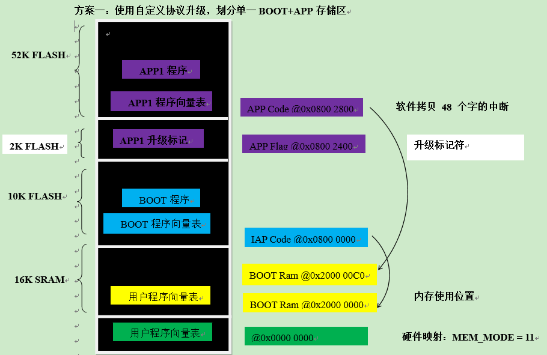
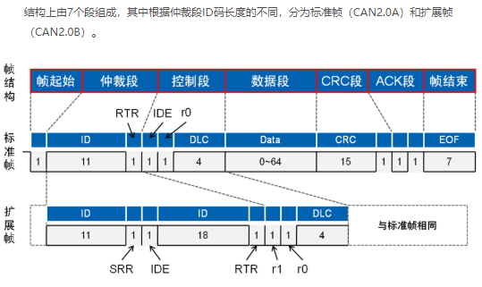
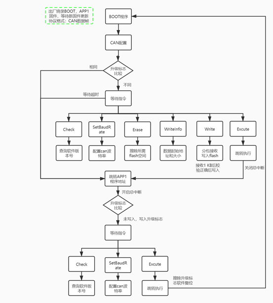

### 1、Flash空间划分

STM32F072C8T6_M0_CAN_IAP：互联型芯片的FLASH_PAGE:2KB，FLASH:64KB，SRAM:16KB




### 2、升级传输方式

创建1KB数组采用**分包缓存接收每帧数据**，根据不同的外设接口协议格式不一（RS485或CAN协议），每帧接收数据都会有回复成功与否，若接收不成功，继续重发这一帧，正确接收完一整包数据后进行CRC校验，校验成功后写入flash，校验不成功，继续重发这一包，依次分包接收后写入flash中。

CAN协议：交互指令和bin文件数据传输都存储在数据帧的数据段中。



交互指令种类定义：

```
CMD_LIST  CMD_List = 
{
 .Erase = 0x00,   //擦除APP区域数据

 .WriteInfo = 0x01, //设置多字节写数据相关参数（写起始地址，数据量）

 .Write = 0x02,   //以多字节形式写数据

 .Check = 0x03,   //检测节点是否在线，同时返回固件信息

 .SetBaudRate = 0x04,//设置节点波特率

 .Excute = 0x05,   //执行固件

 .CmdSuccess = 0x08, //命令执行成功

 .CmdFaild = 0x09,  //命令执行失败
};
```



交互通信的过程： 每个程序都有自己的程序Version（2字节），高1字节为程序大版本号，低1字节为程序小版本号。

1.【控制方 -> 接收方】发送查询版本指令：APP1或BOOT程序回复自身程序版本号给控制方比对有新版本固件后进行下一步指令。

2.【控制方 -> 接收方】发送擦除flash指令：包含APP1程序起始地址和大小，擦除APP1所需扇区大小，擦除成功，回复指令执行成功；擦除失败，回复指令执行失败，重发该指令。

3.【控制方 -> 接收方】发送写入数据信息指令：包含这包数据的起始地址和大小。

4.【控制方 -> 接收方】发送写入APP1程序指令：接收ID递增的CAN包，每接收到1K数据包+2Byte校验值，进行校验正确，回复指令执行成功，依次将APP1程序完全写入到flash中；校验失败，回复指令执行失败，重发该指令。

5.【控制方 -> 接收方】发送执行跳转指令：APP1程序发送完毕并正确写入flash中，发送一个执行跳转指令，跳转APP1程序地址运行。 进入APP1程序后接收到跳转指令会跳转到BOOT程序等待新固件升级步骤。

6.【控制方 -> 接收方】发送查询版本指令：升级软件成功后，查询新APP1的软件版本号