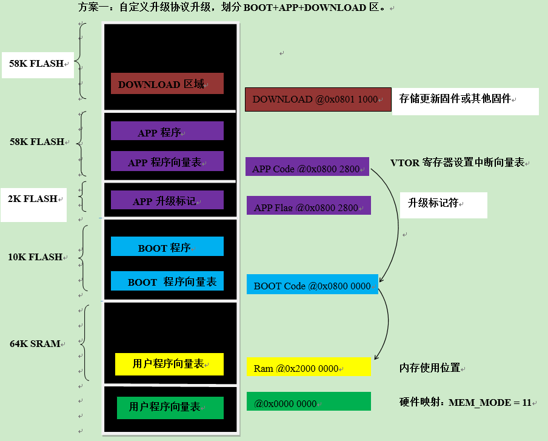
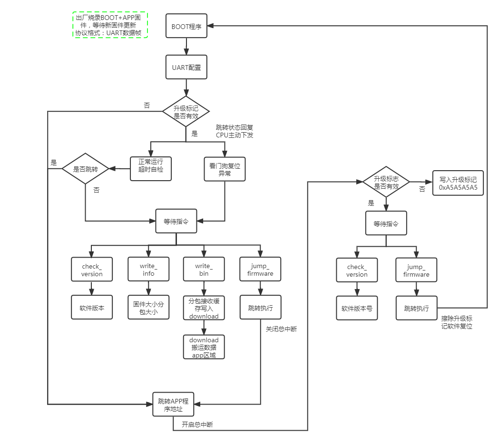

### 1、Flash空间划分

STM32F105RBT6_M3_UART_IAP升级：互联型芯片的FLASH_PAGE为2KB，FLASH:128KB，SRAM:64KB

### 2、升级传输方式

交互通信的过程： 每个程序都有自己的程序Version（2字节），高1字节为程序大版本号，低1字节为程序小版本号。

1.【server -> client】check version：APP或BOOT程序回复自身程序版本号给控制方比对有新版本固件后进行下一步指令。

2.【server -> client】write info：包含这包数据的偏移地址和大小，擦除整块APP区域。

3.【server -> client】write bin：接收ID递增的CAN包，每接收到2K数据包+2Byte校验值，进行校验正确，回复指令执行成功，依次将APP程序完全写入到flash中；校验失败，回复指令执行失败，重发该指令。

4.【server -> client】jump firmware：发送跳转APP程序地址运行。 进入APP程序后接收到跳转指令会跳转到BOOT程序等待新固件升级步骤。

5.【server -> client】check version：升级软件成功后，查询新APP的软件版本号。